# **Progressive Domain Adaptation**

Object detection for autonomous driving related tasks works in dependence of amount of data and data quality. Not for all situations (domains) this can be guaranteed and transfer learning methods must be applied. In particular we focus on the object detection task under day-night domain shift.

In this project we implement a domain adaptation technique, Domain Adversarial Neural Network for the Object Detector YOLOv3, using CycleGAN to generate synthetic domain to further reduce the domain gap. We create three modularizations, train them on [Berkeley Deep Drive dataset](https://bdd-data.berkeley.edu/) and compare the test performance between the 3 modularizations.

#### **Code Structure**
<p align="center">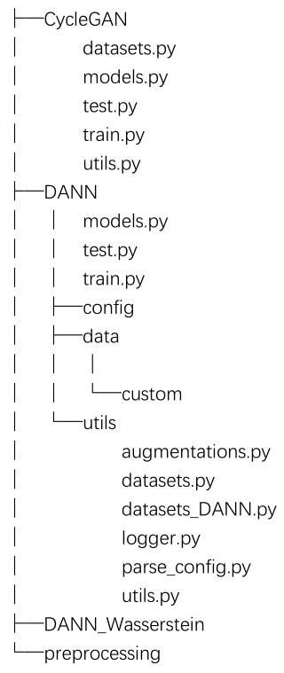</p>

#### **Object Detectors**

This repository has implementations of the object detector in Pytorch:

[YOLOv3](https://arxiv.org/abs/1804.02767)

It uses the Berkeley Deep Drive dataset

#### **CycleGAN**
to run python files contained in the folder CycleGAN, please see the link: https://github.com/aitorzip/PyTorch-CycleGAN
<p align="center">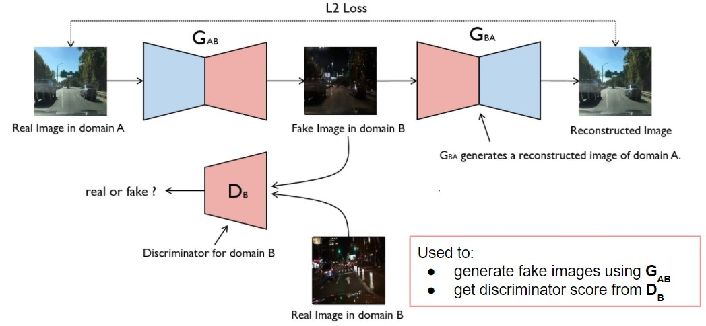</p>

##### **A synthetic domain is generated via CycleGAN**

- Original images:
<p align="center">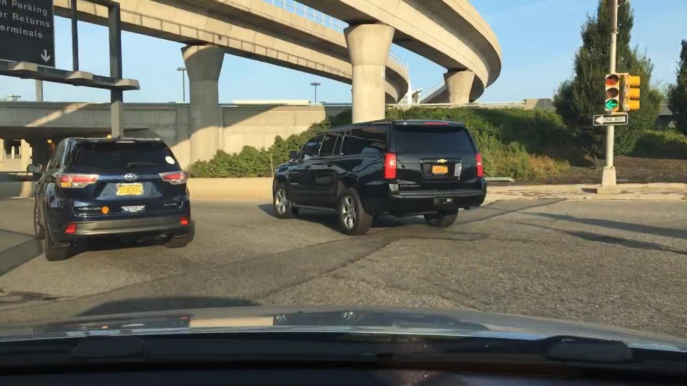</p>

- Generated images:
<p align="center">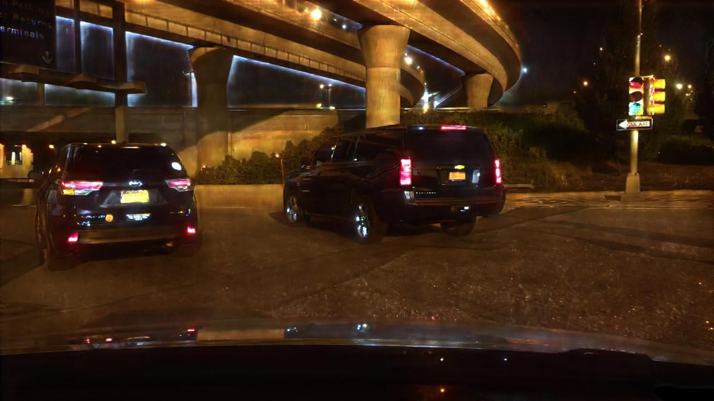</p>

**Generating fake images and weights**

CycleGAN/fake_images_weights.ipynb is used to generate fake night images and their corresponding weights using pretrained model of CycleGAN

#### **DANN (Domain Adversarial Neural Network)**

DANN has been implemented in 3 modularizations on YOLOv3 and tiny-YOLO.

##### **1.Framework**
<p align="center">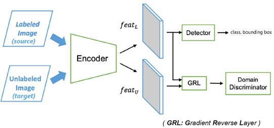</p>

##### **2.Synthetic domain as an intermediate domain**
<p align="center">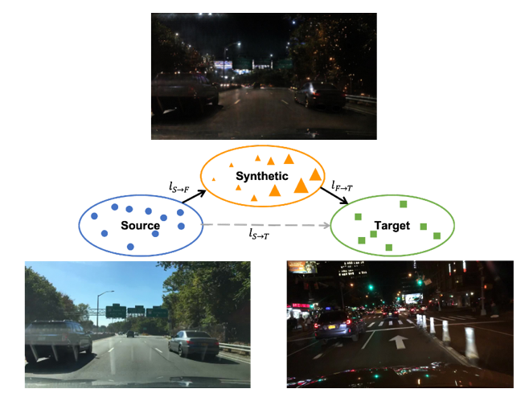</p>

##### **3.Three modularizations:**

- Modularization 1
<p align="center">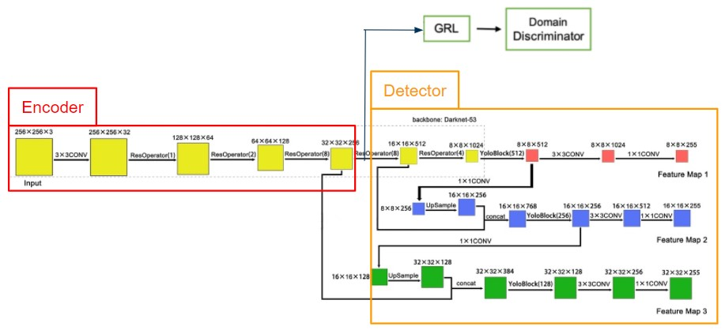</p>

- Modularization 2
<p align="center">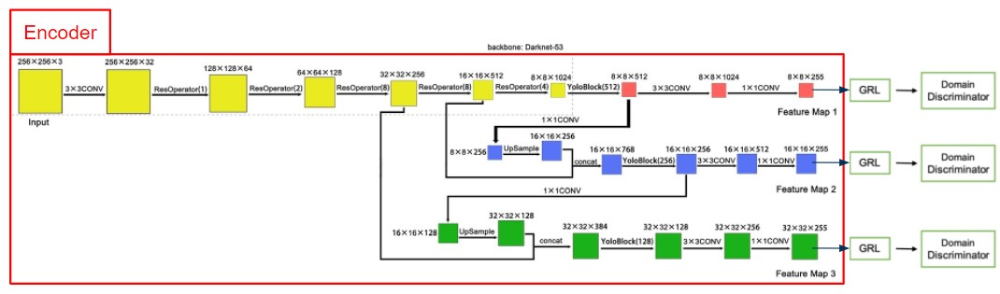</p>

- Modularization 3
<p align="center">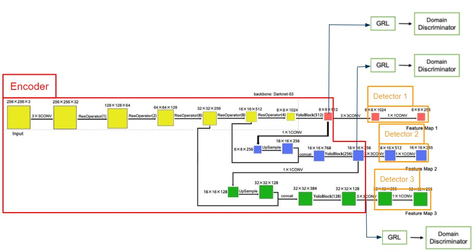</p>

##### **4.Results of DANN training:**

Detection before DANN
<p align="center">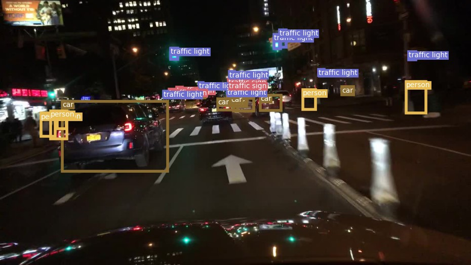</p>

Detection after DANN
<p align="center">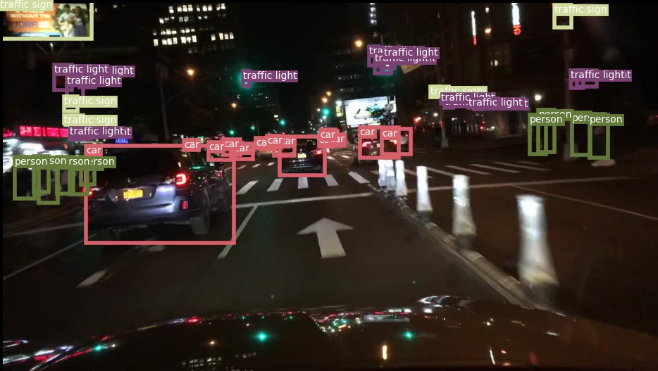</p>


**Dataset Creation**

Before running the train.py, make sure that you create a separate folder "data" in the folder "DANN".
The dataset can be customized by running all the functions in the folder "preprocessing".
If you don't want to preprocess the data yourself, you can directly copy the folder on the remote server and paste it into the folder "data".
(the absolute path to the data folder: /nfs/students/winter-term-2020/project-2/YOLOv3-original-Final/YOLOv3-original-Final-chenrui/data/custom)

**Train**
```
$ train.py [-h] [--epochs EPOCHS] [--batch_size BATCH_SIZE]
                [--data_config DATA_CONFIG] [--modularization MODULARIZATION]
                [--models_def MODELS_DEF] [--pretrained_weights PRETRAINED_WEIGHTS]
                [--weighting WEIGHTING] [--weights_folder WEIGHTS_FOLDER]
                [--update_step UPDATE_STEP] [--img_size IMG_SIZE]
                [--checkpoint_interval CHECKPOINT_INTERVAL]
                [--evaluation_interval EVALUATION_INTERVAL]
                [--multiscale_training MULTISCALE_TRAINING]
                [--gradient_accumulation GRADIENT_ACCUMULATION]
                [--exp_id Experiment id]
```
**Example**

To train on modularization1 using sigmoid weight and joint update step
```sh
cd DANN
python train.py --data_config "config/custom_DANN_cluster_fakenight.data" --modularization 1 --models_def "config/yolov3-Mod1-Encoder.cfg" "config/yolov3-Mod1-Detector.cfg" --weighting "peak_at_one" --update_step "alternating"
```
**Test**
```sh
python test.py --data_config "config/custom_DANN_cluster_fakenight.data" --modularization 1 --models_def "config/yolov3-Mod1-Encoder.cfg" "config/yolov3-Mod1-Detector.cfg" --pretrained_weights "checkpoints-DANN/config1/best_encoder_80.pth" "checkpoints-DANN/config1/best_detector_80.pth"
```

##### **5.DANN\_Wasserstein**

We implemented Wasserstein method on modularization 2 to deal with the fluctuation of discriminator loss

**Train**
```
$ train_m2_Wasserstein.py [-h] [--epochs EPOCHS] [--batch_size BATCH_SIZE]
                               [--gradient_accumulation GRADIENT_ACCUMULATION]
                               [--models_def MODELS_DEF] [--data_config DATA_CONFIG]
                               [--pretrained_weights PRETRAINED_WEIGHTS]
                               [--n_cpu N_CPU] [--img_size IMG_SIZE]
                               [--checkpoint_interval CHECKPOINT_INTERVAL]
                               [--evaluation_interval EVALUATION_INTERVAL]
                               [--compute_map COMPUTE_MAP]
                               [--multiscale_training MULTISCALE_TRAINING]
                               [--input_nc INPUT_NC] [--n_critic N_CRITIC]
```

**Example**

To train the encoder every 5 iterations

```sh
cd DANN_Wasserstein
python train_m2_Wasserstein.py --n_critic 5
```

#### **Literature**

BDD100K: A Diverse Driving Video Database with Scalable Annotation Tooling:https://www.arxiv-vanity.com/papers/1805.04687/

Yolov3: An incremental improvement:https://arxiv.org/abs/1804.02767

Unpaired Image-to-Image Translation using Cycle-Consistent Adversarial Networks:https://arxiv.org/abs/1703.10593

Domain-Adversarial Training of Neural Networks:https://arxiv.org/abs/1505.07818

Domain Adaptation for Object Detection via Style Consistency:https://arxiv.org/abs/1911.10033

Progressive Domain Adaptation for Object Detection:https://arxiv.org/abs/1910.11319

Wasserstein Distance Based Domain Adaptation For Object Detection:https://arxiv.org/abs/1909.08675

Improved Training of Wasserstein GANs:https://arxiv.org/abs/1704.00028
